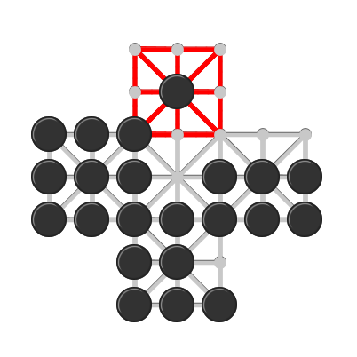

## Офицеры и солдаты

1. Игра ведется на поле показаном на рисунке. 
Верхняя часть креста окружена двойной линией, 
что указывает на то, что это крепость, 
в которую один игрок помещает двух офицеров. 
  

2. У противника 24 солдата, которые занимают клетки 
за пределами крепости. 

3. Офицеры могут захватить одну из фигур противника, 
перепрыгнув через нее на пустое место сразу 
на противоположной стороне фигуры противника. 

4. Солдаты побеждают, заняв все клетки крепости 
или лишив офицеров возможности двигаться; 

5. офицеры побеждают, захватив достаточное количество солдат, 
чтобы предотвратить это.