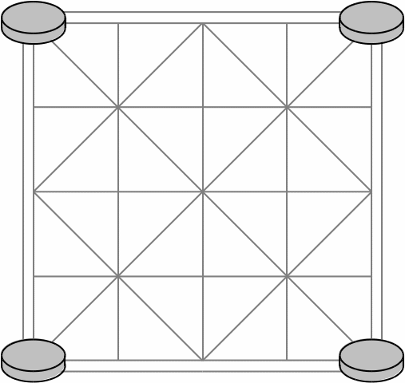

# Правила Баг Чала
Баг Чал — древняя настольная охотничья игра из Непала.

В Баг Чал играют на доске алькерка два игрока.   
  
У одного четыре тигра, а у другого двадцать коз. 
Отныне их будут называть игроком-тигром 
и игроком-козлом.
1. Игра начинается с четырьмя тиграми на доске, 
по одному в каждом углу, как показано на схеме.
2. Двадцать коз остается у игрока, 
перешедшего на их сторону.
3. Игрок-козел делает первый ход.
4. Если у игрока-козла есть козы в руке, 
он должен в свой ход разместить одну из них 
в любом пустом месте на доске.
5. Если игрок-козел расставил всех козлов, 
то вместо этого он должен использовать свой ход, 
чтобы переместить одного из козлов из его текущего положения 
по отмеченной линии в любом направлении 
к соседней пустой клетке.
6. Игрок-тигр в свой ход может переместить тигра 
из его текущего положения по отмеченной линии 
в любом направлении в соседнюю пустую клетку.
7. Только одна фигура может занимать клетку одновременно; 
штабелирование фигур не допускается.
8. Иногда тигр может схватить или съесть козу вместо того, 
чтобы двигаться, как описано в правиле 6.
9. Чтобы съесть козу, игрок-тигр должен прыгнуть 
с одним из своих тигров вдоль отмеченной линии, 
через соседнюю козу, в пустую клетку за ней. 
Затем козел убирается с доски и больше 
не участвует в игре.
10. Тигру нельзя менять направление в середине прыжка. 
Козе грозит быть съеденной только в том случае, 
если с одной стороны у нее тигр, 
а с другой пустое место.
11. За один ход можно съесть только одну козу. 
Многократные прыжки не допускаются.
12. Игрок-тигр выигрывает, 
если его тигры съели пять коз.
13. Игрок с козлом выигрывает, 
если тигры оказались в ловушке 
и у игрока с тиграми нет 
допустимого хода.