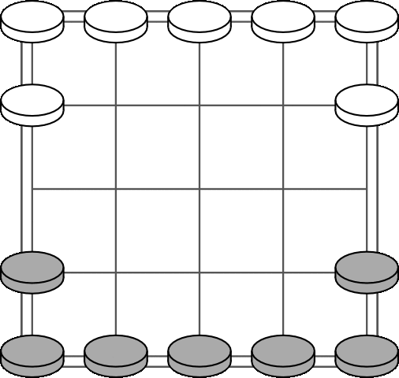

В коно с пятью полями играют два человека на квадратной доске, 
размеченной сеткой из пяти линий в каждом направлении. 
У каждого игрока по семь фигур: один игрок берет черное, 
другой — белое.

1. Доска расставлена так, что каждый игрок имеет 
по пять фигур в клетках своего заднего ряда, 
а две другие - прямо впереди, 
на левом и правом краю доски. 
Это показано на схеме.  

2. Фигуры в этой игре занимают клетки, а не поля.

3. Первыми ходят белые.

4. В свой ход игрок может передвинуть одну фигуру.

5. Фигуры перемещаются на один шаг по диагонали 
вперед или назад.

6. Фигура не может перепрыгивать через другую.

7. В этой игре нет захватов.

8. Только одна фигура может занимать клетку одновременно. 
Таким образом можно заблокировать движение 
фигур противника.

9. Игра заканчивается, когда один игрок перешел по доске, 
заняв все клетки, с которых стартовал соперник. 

10. Если игрок оставляет фигуры на своей начальной стартовой позиции, 
чтобы навсегда заблокировать другого игрока, 
его противник может выиграть, заняв только те клетки, 
которые он освободил.

