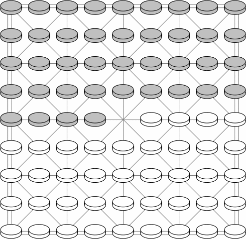

1. В Замму играют два человека 
на клетках показанной доски. 
Фигуры расположены симметрично, 
как показано на рисунке, 
оставляя только одну клетку 
пустой. 
Первый ход белыми.  

2. В свой ход игрок передвигает фигуру 
на один шаг по отмеченной линии, 
в соседнюю пустую клетку. 
В начале игры фигуры не могут двигаться назад 
(по диагонали или иным образом).
3. Фигура захватывает соседнюю фигуру противника, 
перепрыгивая через нее и приземляясь на пустую клетку 
за ней. 
Если возможен захват, его необходимо произвести.
4. Как только фигура достигает заднего ряда, 
она передвигается и может затем двигаться назад 
по отмеченным линиям, а также вперед 
и в стороны.
5. Захватив фугуру противника, 
фигура должна совершить дальнейший прыжок 
и по возможности захватить еще фигуру противника 
с нового места. 
Таким образом можно объединить любое количество 
захватов фигур противника.
6. Партию выигрывает тот игрок, который захватит 
все фигуры противника.